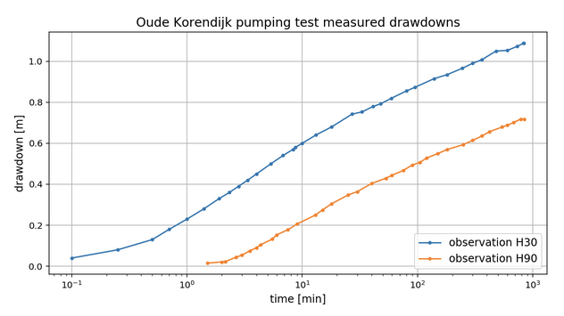
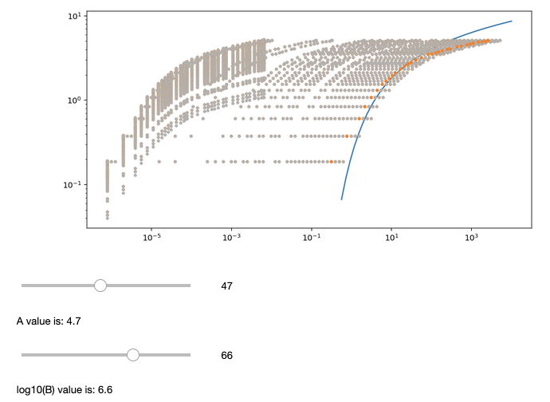
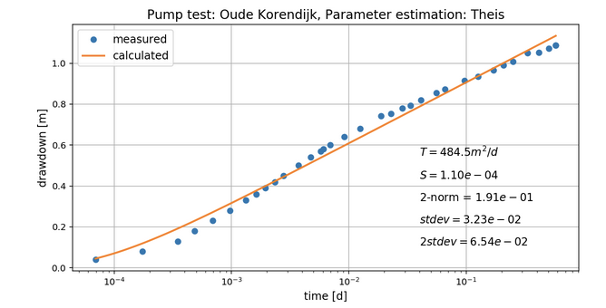

# Summary

A Jupyter notebook is presented that introduces methods for pumping test evaluation. Pumping tests are used for characterizing aquifers and thus provide means for evaluating the potential productivity of groundwater wells. Based on a ’classical’ dataset the notebook outlines and demonstrates the use of several graphical and numerical evaluation methods and lets the user explore the use of the methods in given tasks. Due to its concept of user-friendliness it is also suitable for students without programming knowledge.  The notebook was created as accompanying playground for undergraduate lectures on the topic of hydraulic testing. At the end of the semester, in a questionnaire, the vast majority of the students were positive about the new way of online learning, presented in the notebook.

# Introduction

Pumping tests are a common option in the toolbox of a hydro-geologist. In a pumping test one records the drawdown of the water table due to pumping. The evaluation of the observed data gives values for the basic properties of the aquifer, that is a permeable geological layer containing groundwater (Figure 1). It is assumed that the user is familiar with technical and practical issues of pump tests, as the notebook deals only with the evaluation of the test data. It provides an introduction to classical graphical methods as well as currently favoured numerical methods. 

Before the advance of computers graphical methods have been developed, that can basically be described as type curve matching. The type curve is obtained from the solution of @theis:1935 that has been derived for confined aquifers (which are overlain by an impermeable layer). Extensions for the leaky aquifer that is overlain by a semi-permeable layer, were developed by @HJ:1955 and @hantush:1956. 

Nowadays the evaluation is mostly done on a computer. Mathematically one may describe these methods as inverse modelling procedures. For the mentioned aquifers the numerical methods depend on the same solutions. For the professional practice numerous further extensions have been developed for special cases [@renard:2005], which are not outlined in this introduction for novices to the topic. 

# Statement of Need

Several approaches have ben used to introduce students to the use of computational evaluation methods. They can be distinguished by the software, which is utilized. @cleveland:1996 presented an evaluation method that can be operated on an EXCEL spreadsheet, mimicking the graphical method for matching the Theis typecurve. @LP:2013 described how this method could be applied to student teaching. 

The Hytool 'toolbox for the interpretation of hydualic tests using analytical solutions' [@renard:2017] was developed for MATLAB® users. The package is open source and can be accessed via GitHub [@renard:2020]. Part of the functionality of the Hytool package is available in R [@bertone], or in Python [@pianaro]. 

There are commercial programs also. The most important one, @aqtesolv works on WINDOWS operating systems, and covers many more specific evaluation methods. As an advanced product AQTESOLV covers evaluation methods for many specific cases.

For instructions in the classroom none of these installations is really satisfactory. In all freely available methods previous knowledge on operating the software is required: either EXCEL, MATLAB®, R or Python. Aside from the financial side, the commercial software has the disadvantage that it is available only on WINDOWS. 
    
# The Jupyter Implementation

The notebook by @olsthoorn gave the initial idea for the here presented implementation. A pump test [@wit:1963], performed in the Netherlands and popularized by the well-established textbook of @KdR:1994, is used for demonstrating several evaluation methods. So far this basic idea is also followed here. In the presented hydraulic testing notebook further methods for different aquifer types are introduced. Moreover the notebook has been set up in a way that users who are unskilled in programming can perform all operations easily using buttons, checkboxes, and sliders.  

At first, for instructors we briefly describe some technical aspects. The notebook starts with methods that utilize the steady state or steady shape data only: @thiem for confined and unconfined aquifers, as well as @deglee:1930 for leaky aquifers. Concerning the more common task based on time series data the graphical method of @CJ:1946 is outlined, where the aquifer characteristics are obtained from the slope and zero of a straight line. The classical graphical method is to match the data with the Theis type curve using a transparent paper sheet. In the notebook the user can explore this procedure using sliders. 

Figure 2 is a visualization of the input data in semi-log coordinates. Figure 3 demonstrates curve matching by the operation of sliders. The data curve (dots) is shifted in the direction of the coordinate axes depending upon the operation of the sliders. The aim is to match the dots with the type curve (blue). Former positions of the dots are depicted in grey. The positions corresponding to the actual values of the sliders are shown in orange.  

Finally numerical parameter estimation algorithms are introduced, for confined and for leaky aquifers. The user can select input data and specify initial guesses for the iterative numerical solver. The optimization algorithm is started by mouse click. Figure 4 shows the outcome of a parameter estimation run. Observed values and the type curve are plotted as in the previous figure. The resulting parameter values (T for transmissivity, S for storativity) can be taken from the plot, as well as the measures of fit.

It is instructive to compare the accuracy of the results of the different methods, graphical or computational. In the notebook for all methods measures of fit (residual or standard deviation) can be obtained just by mouse-click.

In summary the hydraulic testing notebook not only explains the various methods, but also enables the user to explore them. Buttons initiate different graphical representations of data, the computation of goodness of fit, and the run of parameter optimization algorithms. The classical graphical method of curve matching is mimicked by sliders that the user can operate in order to shift the observation data set horizontally and vertically (Figure 3). For parameter estimation there are input fields to enter initial guesses for the algorithm start. In addition, the user has the option to choose between two different time series from the same pump test. The differences in results obtained from both datasets may give an idea about the variability and the uncertainty of the results in practice. 

# Lecturing Pump Test Evaluations

The notebook was written accompanying online lectures on hydraulic testing, more specifically for the topic of pumping test evaluations. It was deployed in lectures for undergraduates at the German University of Technology in Oman in 2020 and 2021. The notebook can be obtained from the github source: ‘Hydraulic Testing’ (2021), and used locally on environments where Python and Jupyter are installed. However working with undergraduates it is simpler to provide a link to the students that enables them the use via browser. In the mentioned lecture the notebook was made available and operable to the students via myBinder [@binder]. Using such a link requires no software installation by the students.

The undergraduates were instructed to start by running all cells and hiding the code. In that way the initialization (library import, data reading and the creation of the user interface elements) is performed first. This initialization creates all buttons, checkboxes and sliders by which the students can operate the notebook and work on tasks. 

A task sheet was distributed to the students to note and compare the results that they obtain with the different methods. The students were asked to apply the graphical method and parameter estimations and check the goodness of fit for every method. They were instructed to note all their results in tables and draw conclusions from the comparison. Based on their work on the tasks, they were asked which parameter values for the aquifer characteristics (transmissivity, storativity) they would recommend as final results in a report. They also had to answer what the evaluation reveals about the aquifer type (confined, unconfined, leaky). The comparison of results from many methods yields an idea of the uncertainty of pump test evaluations.

In a questionnaire at the end of the lecture 82 % of the 52 students found the notebook easy to understand, 92% found it easy to operate and 58% would recommend use of notebooks in future lectures. 

For a full understanding of the notebook the students should 
1. have basic knowledge of hydrogeology, i.e. should know about different types of aquifers and the main hydrogeological characteristics 
2. know about technical and practical aspects of pumping tests
3. have basic knowledge about curve fitting, and especially about different measures of fit 
4. have a rough idea about iterative solvers and what to do, if they are not converging

For the use of the notebook in the classroom the instructor should take skills and pre-knowledge of the participants into account. If the background knowledge in the class on one of the noted positions is low, additional teaching is required to bridge the knowledge gap. In a class of undergraduates this may take 3 to 4 lectures. The introduction of the Jupyter notebook might require an additional lecture. The notebook intro should explain the different types of cells in Jupyter, how to run them and what is obtained by running them. As the notebook is designed to be user-friendly, a single lecture for that is sufficient.

The notebook is designed with the aim to allow students to explore the topic by themselves. For the user there is no single red line to follow. She/he may choose a method, obtain a result and then check the accuracy. Due to this concept of user-friendliness it is especially appropriate for self-teaching in online classes. 

The notebook may be used in classes of hydrogeology, when it’s the turn of aquifer testing. For graduates with programming background it can be used differently than for undergraduates. During the lectures the instructor may introduce the concept of inverse modelling and show the notebook as an example of using optimization methods. Students with programming background may be interested to look into the coding, which they can do. 

In the undergraduate class, for which the notebook was implemented, a task sheet was submitted to the participants. The students had to list the results of the different methods for the given pumping test and to compare the accuracy of the results. The task sheet is included in the github source. Later a similar task sheet was used for an assignment, where each student was asked to assume a different pumping rate. Notebooks that are designed in the here described way enable individual tasks and grading. 

The Hydraulic-testing notebook demonstrates, how a Jupyter notebook can be designed for online use by students with or without programming skills. Depending on the previous knowledge in the class the instructor can decide how to use the notebook and what has to be taught in the lectures additionally

# Figures

{width=50%} 

 

# References